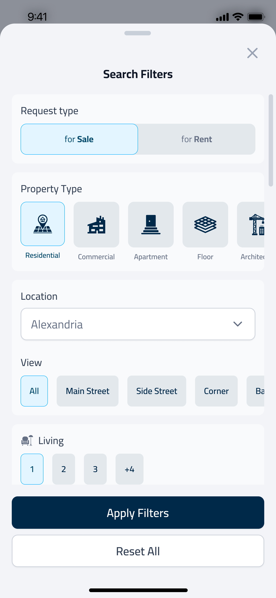
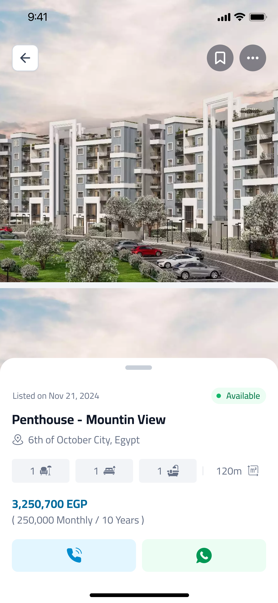
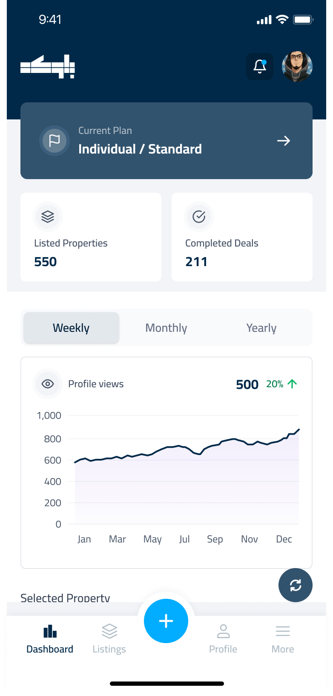

# Blokkah 🏢


**A production-grade, two-sided real-estate marketplace built with Flutter.** One codebase serves buyers, sellers and agents, with an AI chatbot, real-time notifications, in-app payments, deep linking and full English/Arabic (RTL) support.


## 🧭 At a Glance

| | |
|---|---|
| **Platforms** | iOS & Android (single Flutter codebase) |
| **Users** | Buyers, Sellers / Agents, Companies (multi-member teams) |
| **Architecture** | Feature-first, BLoC / Cubit, layered (UI → business logic → data) |
| **Languages** | English & Arabic with RTL layouts |
| **Integrations** | Firebase, Google Maps, Paymob, Branch.io, REST API |

## ✨ Key Features

**Buyers**
- 🏠 Property listings with advanced filters, search history and saved favorites
- 🏢 Agent profiles with properties, reels, blogs and reviews
- 🤖 AI chatbot assistant, FAQ and property-request flow
- 🧮 Mortgage and property-insurance calculators
- 📈 Market trends and insights, Blokkah Points rewards and invite-a-friend

**Sellers / Agents**
- 💼 Property management dashboard with views and performance analytics
- ➕ Multi-step listing creation, featured ads and blog posts
- 💳 Tiered subscription plans (quarterly, semi-annual, annual) paid via Paymob
- 👥 Company accounts with team-member management and multi-profile switching

**Platform**
- 🔐 Authentication via email, phone OTP, Google and Twitter, plus guest mode
- 🌙 Light / dark theme, 🌐 English & Arabic localization
- 🔔 Real-time push notifications, 📍 interactive maps and location services
- 🔗 Deep linking for shareable properties and invites

## 🧠 Engineering Highlights

- **Predictable state with BLoC / Cubit**: a global `BlocObserver` for tracing, feature-scoped blocs and shared cubits for app-wide concerns (theme, locale, session).
- **Feature-first modular architecture**: authentication, home, property, CRM and more are self-contained modules that can be built and tested independently.
- **Resilient networking**: REST integration through Dio with centralized error handling and retry mechanisms.
- **Internationalization done properly**: generated localization (Flutter Intl) with RTL support, not string patching.
- **Role-based experience**: one app, three personas (buyer, seller, company), each with its own navigation, onboarding and permissions.
- **Monetization & growth**: Paymob payments for subscriptions and featured ads, Branch.io deep links, Firebase Analytics for funnel tracking.
- **Design-system discipline**: reusable widget library and central theming following Material Design 3.

## 🏗️ Architecture

```
lib/
├── bloc_observer.dart       # Global BLoC state observer
├── firebase_options.dart    # Firebase configuration
├── main.dart                # Application entry point
├── generated/               # Generated localization files
├── l10n/                    # Localization resources (EN / AR)
├── layout/                  # Core layout
│   ├── app/                 # Main app shell with bottom navigation
│   └── fab/                 # Floating action button & dialogs
├── models/                  # Data models and DTOs
├── modules/                 # Feature modules
│   ├── authentication/      # Sign-up, OTP, social login
│   ├── home/                # Home & discovery
│   ├── property/            # Listings, details, creation
│   ├── crm/                 # CRM & analytics
│   └── more/                # Profile, settings, tools
└── shared/                  # Cross-cutting code
    ├── cubit/               # Global state management
    ├── router/              # Navigation & routing
    ├── theme/               # Theming & styling
    ├── utils/               # Common utilities
    └── widgets/             # Reusable widgets
```

**Why feature-first + BLoC?** Each feature owns its UI, logic and data, so the app scales without cross-feature breakage, state changes are traceable, and business logic stays testable apart from widgets.

## 📱 Screenshots

### 👤 Buyer

<table>
  <tr>
    <td align="center" width="16%"><br/><sub><b>Home</b></sub></td>
    <td align="center" width="16%"><br/><sub><b>Search</b></sub></td>
    <td align="center" width="16%"><br/><sub><b>Filters</b></sub></td>
    <td align="center" width="16%"><br/><sub><b>Property Details</b></sub></td>
    <td align="center" width="16%"><br/><sub><b>AI Chatbot</b></sub></td>
    <td align="center" width="16%"><br/><sub><b>Mortgage Calculator</b></sub></td>
  </tr>
</table>

### 🏢 Seller / Agent

<table>
  <tr>
    <td align="center" width="16%"><br/><sub><b>Dashboard</b></sub></td>
    <td align="center" width="16%"><br/><sub><b>Property Views</b></sub></td>
    <td align="center" width="16%"><br/><sub><b>Add Listing</b></sub></td>
    <td align="center" width="16%"><br/><sub><b>Featured Ads</b></sub></td>
    <td align="center" width="16%"><br/><sub><b>Subscription Plans</b></sub></td>
    <td align="center" width="16%"><br/><sub><b>Team Members</b></sub></td>
  </tr>
</table>

## 🛠️ Tech Stack

| Area | Tools |
|---|---|
| **Framework** | Flutter 3.x, Dart |
| **State management** | flutter_bloc (BLoC / Cubit) |
| **Backend services** | Firebase Auth, Cloud Messaging, Analytics |
| **Auth providers** | Email, phone OTP, Google Sign-In, Twitter Login |
| **Networking** | Dio (REST) |
| **Maps & location** | Google Maps Flutter |
| **Payments** | Paymob |
| **Notifications** | Firebase Cloud Messaging, Flutter Local Notifications |
| **Deep linking** | Branch.io |
| **Local storage** | SharedPreferences |
| **Localization** | Flutter Intl (English & Arabic, RTL) |

## 🎯 Skills Demonstrated

`Flutter` · `Dart` · `BLoC / Cubit` · `Clean, feature-first architecture` · `REST APIs` · `Firebase` · `Payment gateway integration` · `Push notifications` · `Deep linking` · `Maps & geolocation` · `Localization / RTL` · `Material Design 3` · `Role-based UX` · `Analytics`

## 📥 Download
> **Note**: App download links may not be available as the client has not deployed the app yet; check back later.

[](https://apps.apple.com/app/blokkah)
[](https://play.google.com/store/apps/details?id=com.blokkahco.blokkah)


